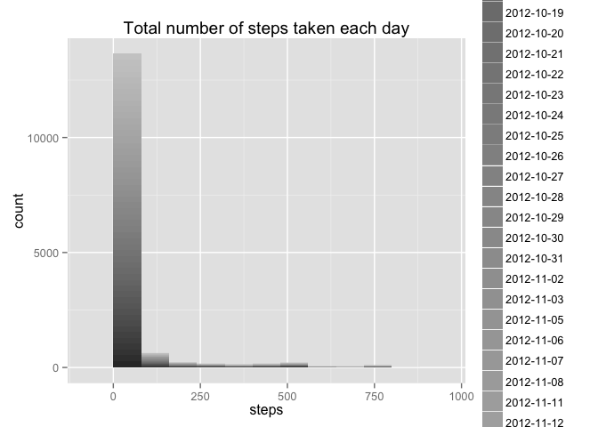
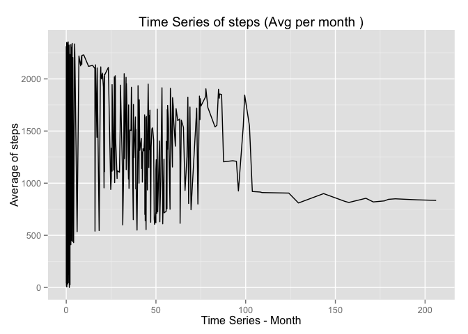
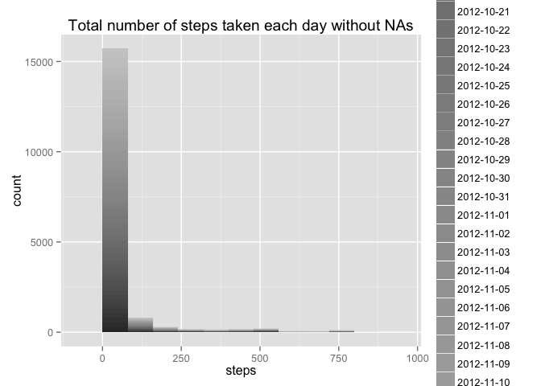
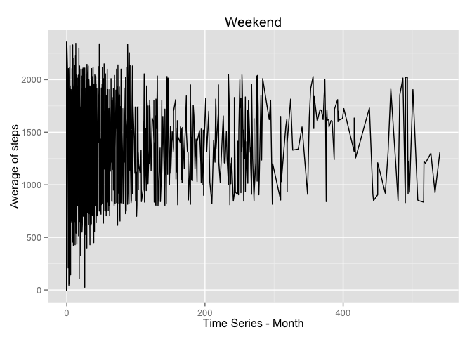
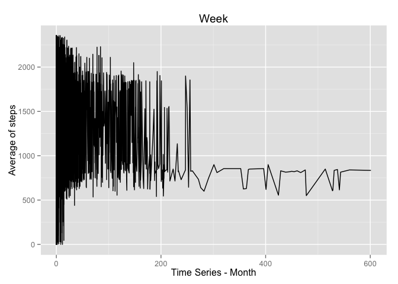

# Reproducible Research: Peer Assessment 1

## Loading and preprocessing the data

```r
        library(ggplot2)
        data <-read.csv('./activity.csv')
        #clean data
        data_1 <- na.omit(data)
```
###Histogram
Plot a histogram to see the number of steps that appears more oftern per day.

```r
        ggplot(data_1, aes(x=steps, fill=date)) + 
                geom_histogram(binwidth=80) +
                ggtitle("Total number of steps taken each day")+
                scale_fill_grey()
```

 

Code to generate the mean and median of the data

```r
        library(xtable)
        #split the data frame
        split_data <- split(data_1, data_1$date)
        #total number of steps per day
        sum_step=sapply(1:61, function(x) sum(unlist(split_data[[x]][1])))
        #find summary of the steps per day
        size<-length(split_data)
        new_data <- data.frame(Id=1:61,
                        median=sapply(1:61, function(x) median(unlist(split_data[[x]][1]))), 
                        mean=sapply(1:61, function(x) mean(unlist(split_data[[x]][1]))))
        xt<-xtable(new_data)
        print(xt,type="html")
```

<!-- html table generated in R 3.1.2 by xtable 1.7-4 package -->
<!-- Sun Apr 19 09:27:46 2015 -->
<table border=1>
<tr> <th>  </th> <th> Id </th> <th> median </th> <th> mean </th>  </tr>
  <tr> <td align="right"> 1 </td> <td align="right">   1 </td> <td align="right">  </td> <td align="right">  </td> </tr>
  <tr> <td align="right"> 2 </td> <td align="right">   2 </td> <td align="right"> 0.00 </td> <td align="right"> 0.44 </td> </tr>
  <tr> <td align="right"> 3 </td> <td align="right">   3 </td> <td align="right"> 0.00 </td> <td align="right"> 39.42 </td> </tr>
  <tr> <td align="right"> 4 </td> <td align="right">   4 </td> <td align="right"> 0.00 </td> <td align="right"> 42.07 </td> </tr>
  <tr> <td align="right"> 5 </td> <td align="right">   5 </td> <td align="right"> 0.00 </td> <td align="right"> 46.16 </td> </tr>
  <tr> <td align="right"> 6 </td> <td align="right">   6 </td> <td align="right"> 0.00 </td> <td align="right"> 53.54 </td> </tr>
  <tr> <td align="right"> 7 </td> <td align="right">   7 </td> <td align="right"> 0.00 </td> <td align="right"> 38.25 </td> </tr>
  <tr> <td align="right"> 8 </td> <td align="right">   8 </td> <td align="right">  </td> <td align="right">  </td> </tr>
  <tr> <td align="right"> 9 </td> <td align="right">   9 </td> <td align="right"> 0.00 </td> <td align="right"> 44.48 </td> </tr>
  <tr> <td align="right"> 10 </td> <td align="right">  10 </td> <td align="right"> 0.00 </td> <td align="right"> 34.38 </td> </tr>
  <tr> <td align="right"> 11 </td> <td align="right">  11 </td> <td align="right"> 0.00 </td> <td align="right"> 35.78 </td> </tr>
  <tr> <td align="right"> 12 </td> <td align="right">  12 </td> <td align="right"> 0.00 </td> <td align="right"> 60.35 </td> </tr>
  <tr> <td align="right"> 13 </td> <td align="right">  13 </td> <td align="right"> 0.00 </td> <td align="right"> 43.15 </td> </tr>
  <tr> <td align="right"> 14 </td> <td align="right">  14 </td> <td align="right"> 0.00 </td> <td align="right"> 52.42 </td> </tr>
  <tr> <td align="right"> 15 </td> <td align="right">  15 </td> <td align="right"> 0.00 </td> <td align="right"> 35.20 </td> </tr>
  <tr> <td align="right"> 16 </td> <td align="right">  16 </td> <td align="right"> 0.00 </td> <td align="right"> 52.38 </td> </tr>
  <tr> <td align="right"> 17 </td> <td align="right">  17 </td> <td align="right"> 0.00 </td> <td align="right"> 46.71 </td> </tr>
  <tr> <td align="right"> 18 </td> <td align="right">  18 </td> <td align="right"> 0.00 </td> <td align="right"> 34.92 </td> </tr>
  <tr> <td align="right"> 19 </td> <td align="right">  19 </td> <td align="right"> 0.00 </td> <td align="right"> 41.07 </td> </tr>
  <tr> <td align="right"> 20 </td> <td align="right">  20 </td> <td align="right"> 0.00 </td> <td align="right"> 36.09 </td> </tr>
  <tr> <td align="right"> 21 </td> <td align="right">  21 </td> <td align="right"> 0.00 </td> <td align="right"> 30.63 </td> </tr>
  <tr> <td align="right"> 22 </td> <td align="right">  22 </td> <td align="right"> 0.00 </td> <td align="right"> 46.74 </td> </tr>
  <tr> <td align="right"> 23 </td> <td align="right">  23 </td> <td align="right"> 0.00 </td> <td align="right"> 30.97 </td> </tr>
  <tr> <td align="right"> 24 </td> <td align="right">  24 </td> <td align="right"> 0.00 </td> <td align="right"> 29.01 </td> </tr>
  <tr> <td align="right"> 25 </td> <td align="right">  25 </td> <td align="right"> 0.00 </td> <td align="right"> 8.65 </td> </tr>
  <tr> <td align="right"> 26 </td> <td align="right">  26 </td> <td align="right"> 0.00 </td> <td align="right"> 23.53 </td> </tr>
  <tr> <td align="right"> 27 </td> <td align="right">  27 </td> <td align="right"> 0.00 </td> <td align="right"> 35.14 </td> </tr>
  <tr> <td align="right"> 28 </td> <td align="right">  28 </td> <td align="right"> 0.00 </td> <td align="right"> 39.78 </td> </tr>
  <tr> <td align="right"> 29 </td> <td align="right">  29 </td> <td align="right"> 0.00 </td> <td align="right"> 17.42 </td> </tr>
  <tr> <td align="right"> 30 </td> <td align="right">  30 </td> <td align="right"> 0.00 </td> <td align="right"> 34.09 </td> </tr>
  <tr> <td align="right"> 31 </td> <td align="right">  31 </td> <td align="right"> 0.00 </td> <td align="right"> 53.52 </td> </tr>
  <tr> <td align="right"> 32 </td> <td align="right">  32 </td> <td align="right">  </td> <td align="right">  </td> </tr>
  <tr> <td align="right"> 33 </td> <td align="right">  33 </td> <td align="right"> 0.00 </td> <td align="right"> 36.81 </td> </tr>
  <tr> <td align="right"> 34 </td> <td align="right">  34 </td> <td align="right"> 0.00 </td> <td align="right"> 36.70 </td> </tr>
  <tr> <td align="right"> 35 </td> <td align="right">  35 </td> <td align="right">  </td> <td align="right">  </td> </tr>
  <tr> <td align="right"> 36 </td> <td align="right">  36 </td> <td align="right"> 0.00 </td> <td align="right"> 36.25 </td> </tr>
  <tr> <td align="right"> 37 </td> <td align="right">  37 </td> <td align="right"> 0.00 </td> <td align="right"> 28.94 </td> </tr>
  <tr> <td align="right"> 38 </td> <td align="right">  38 </td> <td align="right"> 0.00 </td> <td align="right"> 44.73 </td> </tr>
  <tr> <td align="right"> 39 </td> <td align="right">  39 </td> <td align="right"> 0.00 </td> <td align="right"> 11.18 </td> </tr>
  <tr> <td align="right"> 40 </td> <td align="right">  40 </td> <td align="right">  </td> <td align="right">  </td> </tr>
  <tr> <td align="right"> 41 </td> <td align="right">  41 </td> <td align="right">  </td> <td align="right">  </td> </tr>
  <tr> <td align="right"> 42 </td> <td align="right">  42 </td> <td align="right"> 0.00 </td> <td align="right"> 43.78 </td> </tr>
  <tr> <td align="right"> 43 </td> <td align="right">  43 </td> <td align="right"> 0.00 </td> <td align="right"> 37.38 </td> </tr>
  <tr> <td align="right"> 44 </td> <td align="right">  44 </td> <td align="right"> 0.00 </td> <td align="right"> 25.47 </td> </tr>
  <tr> <td align="right"> 45 </td> <td align="right">  45 </td> <td align="right">  </td> <td align="right">  </td> </tr>
  <tr> <td align="right"> 46 </td> <td align="right">  46 </td> <td align="right"> 0.00 </td> <td align="right"> 0.14 </td> </tr>
  <tr> <td align="right"> 47 </td> <td align="right">  47 </td> <td align="right"> 0.00 </td> <td align="right"> 18.89 </td> </tr>
  <tr> <td align="right"> 48 </td> <td align="right">  48 </td> <td align="right"> 0.00 </td> <td align="right"> 49.79 </td> </tr>
  <tr> <td align="right"> 49 </td> <td align="right">  49 </td> <td align="right"> 0.00 </td> <td align="right"> 52.47 </td> </tr>
  <tr> <td align="right"> 50 </td> <td align="right">  50 </td> <td align="right"> 0.00 </td> <td align="right"> 30.70 </td> </tr>
  <tr> <td align="right"> 51 </td> <td align="right">  51 </td> <td align="right"> 0.00 </td> <td align="right"> 15.53 </td> </tr>
  <tr> <td align="right"> 52 </td> <td align="right">  52 </td> <td align="right"> 0.00 </td> <td align="right"> 44.40 </td> </tr>
  <tr> <td align="right"> 53 </td> <td align="right">  53 </td> <td align="right"> 0.00 </td> <td align="right"> 70.93 </td> </tr>
  <tr> <td align="right"> 54 </td> <td align="right">  54 </td> <td align="right"> 0.00 </td> <td align="right"> 73.59 </td> </tr>
  <tr> <td align="right"> 55 </td> <td align="right">  55 </td> <td align="right"> 0.00 </td> <td align="right"> 50.27 </td> </tr>
  <tr> <td align="right"> 56 </td> <td align="right">  56 </td> <td align="right"> 0.00 </td> <td align="right"> 41.09 </td> </tr>
  <tr> <td align="right"> 57 </td> <td align="right">  57 </td> <td align="right"> 0.00 </td> <td align="right"> 38.76 </td> </tr>
  <tr> <td align="right"> 58 </td> <td align="right">  58 </td> <td align="right"> 0.00 </td> <td align="right"> 47.38 </td> </tr>
  <tr> <td align="right"> 59 </td> <td align="right">  59 </td> <td align="right"> 0.00 </td> <td align="right"> 35.36 </td> </tr>
  <tr> <td align="right"> 60 </td> <td align="right">  60 </td> <td align="right"> 0.00 </td> <td align="right"> 24.47 </td> </tr>
  <tr> <td align="right"> 61 </td> <td align="right">  61 </td> <td align="right">  </td> <td align="right">  </td> </tr>
   </table>
## What is mean total number of steps taken per day?

```r
split_data <- split(data$steps,data$date)
        new_data <- as.data.frame(split_data)
        #find the avereage accross all days
        step_mean<-rowMeans(new_data,na.rm = TRUE)
        #set interval
        split_interval <- split(data$interval,data$date)
        df <- data.frame(interval=split_interval[[1]], means_step=step_mean)

        #find the max avg step
        max_mean_step <- sort(df$means_step, decreasing=TRUE)[1]
        #Print the max
        question_2<-df[df$means_step==max_mean_step,]
        xt<-xtable(question_2)
        print(xt,type="html")
```

<!-- html table generated in R 3.1.2 by xtable 1.7-4 package -->
<!-- Sun Apr 19 09:27:46 2015 -->
<table border=1>
<tr> <th>  </th> <th> interval </th> <th> means_step </th>  </tr>
  <tr> <td align="right"> 104 </td> <td align="right"> 835 </td> <td align="right"> 206.17 </td> </tr>
   </table>

## What is the average daily activity pattern?
The next graph shows the average daily activity pattern

```r
        ggplot( data = df, aes( means_step, interval )) + 
                geom_line() +
                ggtitle("Time Series of steps (Avg per month )")+
                xlab("Time Series - Month") +
                ylab("Average of steps") 
```

 
## Imputing missing values
Find the missing values

```r
na_data<- apply(data, 1, function(x){any(is.na(x))})
        na_data<-data[na_data,]
```

Generate new data frame for the NA values. Replace the values with the mean of the interval.

```r
split_intevals <- split(data$interval,data$date)
        dfM <- data.frame(step_mean,interval=split_intevals[1])
        update_values <- function(step,interval) if(is.na(step)) { step=dfM[dfM$X2012.10.01==interval,][1,1] }else{ step }
        new_df <-data
        new_df$steps <- mapply(update_values,new_df$steps,new_df$interval)
```

Generate new histogram plot

```r
        ggplot(new_df, aes(x=steps, fill=date)) + 
                geom_histogram(binwidth=80) +
                ggtitle("Total number of steps taken each day without NAs")+
                scale_fill_grey()
```

 

Generate mean and median

```r
        #split the data frame
        split_data_na <- split(new_df, new_df$date)
        #total number of steps per day
        sum_step=sapply(1:61, function(x) sum(unlist(split_data_na[[x]][1])))
        #find summary of the steps per day
        new_data_na <- data.frame(Id=1:61,
                        median=sapply(1:61, function(x) median(unlist(split_data_na[[x]][1]))), 
                        mean=sapply(1:61, function(x) mean(unlist(split_data_na[[x]][1]))))
        xt<-xtable(new_data_na)
        print(xt,type="html")
```

<!-- html table generated in R 3.1.2 by xtable 1.7-4 package -->
<!-- Sun Apr 19 09:27:48 2015 -->
<table border=1>
<tr> <th>  </th> <th> Id </th> <th> median </th> <th> mean </th>  </tr>
  <tr> <td align="right"> 1 </td> <td align="right">   1 </td> <td align="right"> 34.11 </td> <td align="right"> 37.38 </td> </tr>
  <tr> <td align="right"> 2 </td> <td align="right">   2 </td> <td align="right"> 0.00 </td> <td align="right"> 0.44 </td> </tr>
  <tr> <td align="right"> 3 </td> <td align="right">   3 </td> <td align="right"> 0.00 </td> <td align="right"> 39.42 </td> </tr>
  <tr> <td align="right"> 4 </td> <td align="right">   4 </td> <td align="right"> 0.00 </td> <td align="right"> 42.07 </td> </tr>
  <tr> <td align="right"> 5 </td> <td align="right">   5 </td> <td align="right"> 0.00 </td> <td align="right"> 46.16 </td> </tr>
  <tr> <td align="right"> 6 </td> <td align="right">   6 </td> <td align="right"> 0.00 </td> <td align="right"> 53.54 </td> </tr>
  <tr> <td align="right"> 7 </td> <td align="right">   7 </td> <td align="right"> 0.00 </td> <td align="right"> 38.25 </td> </tr>
  <tr> <td align="right"> 8 </td> <td align="right">   8 </td> <td align="right"> 34.11 </td> <td align="right"> 37.38 </td> </tr>
  <tr> <td align="right"> 9 </td> <td align="right">   9 </td> <td align="right"> 0.00 </td> <td align="right"> 44.48 </td> </tr>
  <tr> <td align="right"> 10 </td> <td align="right">  10 </td> <td align="right"> 0.00 </td> <td align="right"> 34.38 </td> </tr>
  <tr> <td align="right"> 11 </td> <td align="right">  11 </td> <td align="right"> 0.00 </td> <td align="right"> 35.78 </td> </tr>
  <tr> <td align="right"> 12 </td> <td align="right">  12 </td> <td align="right"> 0.00 </td> <td align="right"> 60.35 </td> </tr>
  <tr> <td align="right"> 13 </td> <td align="right">  13 </td> <td align="right"> 0.00 </td> <td align="right"> 43.15 </td> </tr>
  <tr> <td align="right"> 14 </td> <td align="right">  14 </td> <td align="right"> 0.00 </td> <td align="right"> 52.42 </td> </tr>
  <tr> <td align="right"> 15 </td> <td align="right">  15 </td> <td align="right"> 0.00 </td> <td align="right"> 35.20 </td> </tr>
  <tr> <td align="right"> 16 </td> <td align="right">  16 </td> <td align="right"> 0.00 </td> <td align="right"> 52.38 </td> </tr>
  <tr> <td align="right"> 17 </td> <td align="right">  17 </td> <td align="right"> 0.00 </td> <td align="right"> 46.71 </td> </tr>
  <tr> <td align="right"> 18 </td> <td align="right">  18 </td> <td align="right"> 0.00 </td> <td align="right"> 34.92 </td> </tr>
  <tr> <td align="right"> 19 </td> <td align="right">  19 </td> <td align="right"> 0.00 </td> <td align="right"> 41.07 </td> </tr>
  <tr> <td align="right"> 20 </td> <td align="right">  20 </td> <td align="right"> 0.00 </td> <td align="right"> 36.09 </td> </tr>
  <tr> <td align="right"> 21 </td> <td align="right">  21 </td> <td align="right"> 0.00 </td> <td align="right"> 30.63 </td> </tr>
  <tr> <td align="right"> 22 </td> <td align="right">  22 </td> <td align="right"> 0.00 </td> <td align="right"> 46.74 </td> </tr>
  <tr> <td align="right"> 23 </td> <td align="right">  23 </td> <td align="right"> 0.00 </td> <td align="right"> 30.97 </td> </tr>
  <tr> <td align="right"> 24 </td> <td align="right">  24 </td> <td align="right"> 0.00 </td> <td align="right"> 29.01 </td> </tr>
  <tr> <td align="right"> 25 </td> <td align="right">  25 </td> <td align="right"> 0.00 </td> <td align="right"> 8.65 </td> </tr>
  <tr> <td align="right"> 26 </td> <td align="right">  26 </td> <td align="right"> 0.00 </td> <td align="right"> 23.53 </td> </tr>
  <tr> <td align="right"> 27 </td> <td align="right">  27 </td> <td align="right"> 0.00 </td> <td align="right"> 35.14 </td> </tr>
  <tr> <td align="right"> 28 </td> <td align="right">  28 </td> <td align="right"> 0.00 </td> <td align="right"> 39.78 </td> </tr>
  <tr> <td align="right"> 29 </td> <td align="right">  29 </td> <td align="right"> 0.00 </td> <td align="right"> 17.42 </td> </tr>
  <tr> <td align="right"> 30 </td> <td align="right">  30 </td> <td align="right"> 0.00 </td> <td align="right"> 34.09 </td> </tr>
  <tr> <td align="right"> 31 </td> <td align="right">  31 </td> <td align="right"> 0.00 </td> <td align="right"> 53.52 </td> </tr>
  <tr> <td align="right"> 32 </td> <td align="right">  32 </td> <td align="right"> 34.11 </td> <td align="right"> 37.38 </td> </tr>
  <tr> <td align="right"> 33 </td> <td align="right">  33 </td> <td align="right"> 0.00 </td> <td align="right"> 36.81 </td> </tr>
  <tr> <td align="right"> 34 </td> <td align="right">  34 </td> <td align="right"> 0.00 </td> <td align="right"> 36.70 </td> </tr>
  <tr> <td align="right"> 35 </td> <td align="right">  35 </td> <td align="right"> 34.11 </td> <td align="right"> 37.38 </td> </tr>
  <tr> <td align="right"> 36 </td> <td align="right">  36 </td> <td align="right"> 0.00 </td> <td align="right"> 36.25 </td> </tr>
  <tr> <td align="right"> 37 </td> <td align="right">  37 </td> <td align="right"> 0.00 </td> <td align="right"> 28.94 </td> </tr>
  <tr> <td align="right"> 38 </td> <td align="right">  38 </td> <td align="right"> 0.00 </td> <td align="right"> 44.73 </td> </tr>
  <tr> <td align="right"> 39 </td> <td align="right">  39 </td> <td align="right"> 0.00 </td> <td align="right"> 11.18 </td> </tr>
  <tr> <td align="right"> 40 </td> <td align="right">  40 </td> <td align="right"> 34.11 </td> <td align="right"> 37.38 </td> </tr>
  <tr> <td align="right"> 41 </td> <td align="right">  41 </td> <td align="right"> 34.11 </td> <td align="right"> 37.38 </td> </tr>
  <tr> <td align="right"> 42 </td> <td align="right">  42 </td> <td align="right"> 0.00 </td> <td align="right"> 43.78 </td> </tr>
  <tr> <td align="right"> 43 </td> <td align="right">  43 </td> <td align="right"> 0.00 </td> <td align="right"> 37.38 </td> </tr>
  <tr> <td align="right"> 44 </td> <td align="right">  44 </td> <td align="right"> 0.00 </td> <td align="right"> 25.47 </td> </tr>
  <tr> <td align="right"> 45 </td> <td align="right">  45 </td> <td align="right"> 34.11 </td> <td align="right"> 37.38 </td> </tr>
  <tr> <td align="right"> 46 </td> <td align="right">  46 </td> <td align="right"> 0.00 </td> <td align="right"> 0.14 </td> </tr>
  <tr> <td align="right"> 47 </td> <td align="right">  47 </td> <td align="right"> 0.00 </td> <td align="right"> 18.89 </td> </tr>
  <tr> <td align="right"> 48 </td> <td align="right">  48 </td> <td align="right"> 0.00 </td> <td align="right"> 49.79 </td> </tr>
  <tr> <td align="right"> 49 </td> <td align="right">  49 </td> <td align="right"> 0.00 </td> <td align="right"> 52.47 </td> </tr>
  <tr> <td align="right"> 50 </td> <td align="right">  50 </td> <td align="right"> 0.00 </td> <td align="right"> 30.70 </td> </tr>
  <tr> <td align="right"> 51 </td> <td align="right">  51 </td> <td align="right"> 0.00 </td> <td align="right"> 15.53 </td> </tr>
  <tr> <td align="right"> 52 </td> <td align="right">  52 </td> <td align="right"> 0.00 </td> <td align="right"> 44.40 </td> </tr>
  <tr> <td align="right"> 53 </td> <td align="right">  53 </td> <td align="right"> 0.00 </td> <td align="right"> 70.93 </td> </tr>
  <tr> <td align="right"> 54 </td> <td align="right">  54 </td> <td align="right"> 0.00 </td> <td align="right"> 73.59 </td> </tr>
  <tr> <td align="right"> 55 </td> <td align="right">  55 </td> <td align="right"> 0.00 </td> <td align="right"> 50.27 </td> </tr>
  <tr> <td align="right"> 56 </td> <td align="right">  56 </td> <td align="right"> 0.00 </td> <td align="right"> 41.09 </td> </tr>
  <tr> <td align="right"> 57 </td> <td align="right">  57 </td> <td align="right"> 0.00 </td> <td align="right"> 38.76 </td> </tr>
  <tr> <td align="right"> 58 </td> <td align="right">  58 </td> <td align="right"> 0.00 </td> <td align="right"> 47.38 </td> </tr>
  <tr> <td align="right"> 59 </td> <td align="right">  59 </td> <td align="right"> 0.00 </td> <td align="right"> 35.36 </td> </tr>
  <tr> <td align="right"> 60 </td> <td align="right">  60 </td> <td align="right"> 0.00 </td> <td align="right"> 24.47 </td> </tr>
  <tr> <td align="right"> 61 </td> <td align="right">  61 </td> <td align="right"> 34.11 </td> <td align="right"> 37.38 </td> </tr>
   </table>
## Are there differences in activity patterns between weekdays and weekends?
Create the factors

```r
df_last<-data
        df_last$day <- weekdays(as.Date(df_last$date))
        v_weekdays <- c("Monday", "Tuesday", "Wednesday", "Thursday", 
                        "Friday")
        
        v_weekend <- c("Saturday","Sunday")
        
        df_weekdays <- df_last[df_last$day %in% v_weekdays ,]
        df_weekend <- df_last[df_last$day %in% v_weekend ,]
        
        #split the data for week days
        split_data <- split(df_weekdays$steps,df_weekdays$day)
        new_data <- as.data.frame(split_data)
        #find the avereage accross all days
        step_mean<-rowMeans(new_data,na.rm = TRUE)
        #set interval
        split_interval <- split(df_weekdays$interval,df_weekdays$date)
        df1 <- data.frame(interval=split_interval[[1]], means_step=step_mean)
        
        #find the max avg step
        max_mean_step <- sort(df1$means_step, decreasing=TRUE)[1]
        #Print the max
        df1[df1$means_step==max_mean_step,]
```

    interval means_step
680      835      601.2

```r
        split_data <- split(df_weekend$steps,df_weekend$day)
        new_data <- as.data.frame(split_data)
        step_mean<-rowMeans(new_data,na.rm = TRUE)
        df2 <- data.frame(interval=split_interval[[1]], means_step=step_mean)
```
Plot the data

```r
        #plot
        ggplot( data = df2, aes( means_step, interval )) + 
                geom_line() +
                ggtitle("Weekend")+
                xlab("Time Series - Month") +
                ylab("Average of steps") 
```

 

```r
        ggplot( data = df1, aes( means_step, interval )) + 
                geom_line() +
                ggtitle("Week")+
                xlab("Time Series - Month") +
                ylab("Average of steps")   
```

 
